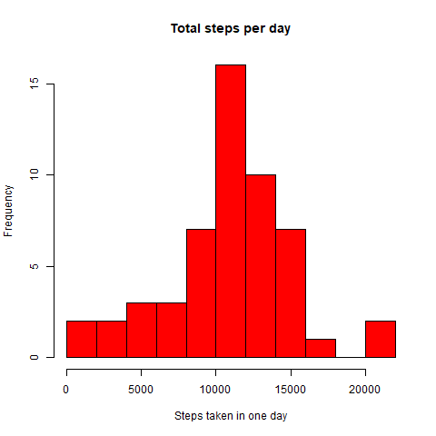

This data used here is from a personal activity monitoring device.
This device collects data at 5 minute intervals through out the
day. The data consists of two months of data from an anonymous
individual collected during the months of October and November, 2012
and include the number of steps taken in 5 minute intervals each day.

The variables included in this dataset are:

* **steps**: Number of steps taking in a 5-minute interval (missing
    values are coded as `NA`)

* **date**: The date on which the measurement was taken in YYYY-MM-DD
    format

* **interval**: Identifier for the 5-minute interval in which
    measurement was taken

The dataset is stored in a comma-separated-value (CSV) file and there
are a total of 17,568 observations in this dataset.


## Loading and preprocessing the data
1. Download and/or unzip Activity Monitoring Data, and read it in
```{r Download and/or unzip, echo=TRUE, results='hide', message=FALSE, warning=FALSE}
file <- "activity.zip"
if (!file.exists(file)){
    download.file("https://d396qusza40orc.cloudfront.net/repdata%2Fdata%2Factivity.zip",file)
}
unzip(file,overwrite=FALSE)
activity <- read.csv("activity.csv",header=TRUE)
print(head(activity[complete.cases(activity),]),type=html)
```


2. Convert dates column to dates
```{r convertdates, echo=TRUE}
activity$date <- as.Date(activity$date,format="%Y-%m-%d")
```


## Mean total number of steps taken per day
1. Number of steps for each day
```{r perday, echo=TRUE}
stepsperday <- aggregate(activity$steps,by=list(Date=activity$date),FUN=sum)
print(stepsperday[complete.cases(stepsperday),])
```


2. Histogram - number of steps taken in one day
```{r stepshisto, echo=TRUE, results='hide', message=FALSE, warning=FALSE}
dir.create("figure")
png("figure/stepshisto.png",height=480,width=480)
hist(stepsperday$x,col="red",
     main="Total steps per day",
     xlab="Steps taken in one day",
     breaks=nrow(stepsperday)/4
     )
dev.off()
```
 

3. Mean and Median steps taken per day
```{r meanmedian, echo=TRUE}
print(c("Mean steps per day: ", mean(stepsperday$x, na.rm=TRUE)))
print(c("Median steps per day: ", median(stepsperday$x, na.rm=TRUE)))
```


## What is the average daily activity pattern?
1. Time series plot of 5-minute intervals and average of number of steps taken across all days.

Get the average number of steps per interval.
```{r averagesteps, echo=TRUE}
meanperinterval <- aggregate(steps ~ interval, data=activity,FUN=mean,na.rm=TRUE)
```

Convert the time intervals to a formal time format.
```{r maketime, echo=TRUE}
meanperinterval$minute <- seq(from=0,to=1435,by=5)
fourchar <- sprintf("%04d",meanperinterval$interval)
meanperinterval$time <- format(strptime(fourchar, format="%H%M"), format="%H:%M")
print(tail(meanperinterval))
```

Plot time series
```{r timeseries, echo=TRUE, results='hide', message=FALSE, warning=FALSE}
png("figure/timeseries.png",height=480,width=480)
plot(steps ~ minute, data=meanperinterval,type="l",col="red",
     main="Average number of steps taken at each 5-minute interval",
     xlab="Time of day (minutes)",
     ylab="Average number of steps"
     )
dev.off()
```
 


2. Interval with maximum steps

```{r maxsteps, echo=TRUE}
intervalend <- max(meanperinterval$steps)
index <- which(meanperinterval$steps==intervalend)
print(c("From ",meanperinterval$time[index-1]," to ", meanperinterval$time[index]))
```


## Imputing missing values
1. Total number of missing values
```{r countmissing, echo=TRUE}
print(sum(!complete.cases(activity)))
```


2. Strategy to fill in missing values

Strategy replaces each missing value with the average of number of steps for that interval on that day of the week.
**imputesteps** will take vectors of dates and intervals that had missing step values, and return imputed values vector.
```{r replacemissing, echo=TRUE}
activity$day <- weekdays.Date(activity$date)
Monday <- aggregate(steps ~ interval, data=subset(activity,day=="Monday"),FUN=mean,na.rm=TRUE)
Tuesday <- aggregate(steps ~ interval, data=subset(activity,day=="Tuesday"),FUN=mean,na.rm=TRUE)
Wednesday <- aggregate(steps ~ interval, data=subset(activity,day=="Wednesday"),FUN=mean,na.rm=TRUE)
Thursday <- aggregate(steps ~ interval, data=subset(activity,day=="Thursday"),FUN=mean,na.rm=TRUE)
Friday <- aggregate(steps ~ interval, data=subset(activity,day=="Friday"),FUN=mean,na.rm=TRUE)
Saturday <- aggregate(steps ~ interval, data=subset(activity,day=="Saturday"),FUN=mean,na.rm=TRUE)
Sunday <- aggregate(steps ~ interval, data=subset(activity,day=="Sunday"),FUN=mean,na.rm=TRUE)
meanbyday <- sapply(c("Monday","Tuesday","Wednesday","Thursday","Friday","Saturday","Sunday"),
       get, environment(), simplify=FALSE)
rm(Monday,Tuesday,Wednesday,Thursday,Friday,Saturday,Sunday)

imputesteps <- function(dates, intervals){
    missing <- data.frame(day=weekdays.Date(dates),interval=intervals)
    missing$steps <- 0
    for (i in names(meanbyday)){
        indeces <- which(missing$day==i)
        for (j in indeces){
            missing$steps[j] <-  meanbyday[[i]]$steps[
                meanbyday[[i]]$interval==missing$interval[j]
                ]
        }
    }
    return(missing$steps)
}
```


3. New dataset with filled missing values

**activity2** is the new dataset with missing values filled in.
```{r newdataset, echo=TRUE}
activity2 <- read.csv("activity.csv",header=TRUE)
activity2$date <- as.Date(activity2$date,format="%Y-%m-%d")
missing <- activity2[is.na(activity2$steps),]
activity2$steps[is.na(activity2$steps)] <- imputesteps(missing$date,missing$interval)
```


4. New histogram of total number of steps each day, mean, median
```{r newmean, echo=TRUE, results='hide', message=FALSE, warning=FALSE}
stepsperday2 <- aggregate(activity2$steps,by=list(Date=activity2$date),FUN=sum)
png("figure/newmean.png",height=480,width=480)
hist(stepsperday2$x,col="red",
     main="Total steps per day",
     xlab="Steps taken in one day",
     breaks=nrow(stepsperday2)/4
     )
dev.off()
```
```{r printnew, echo=TRUE}
print(c("Mean steps per day: ", mean(stepsperday2$x)))
print(c("Median steps per day: ", median(stepsperday2$x)))
```
 

Both the mean and median changed. The biggest difference that arose from filling in missing values, is that the median is now slightly higher than the mean and by a larger margin. I did not impute using the estimates of the total daily number of steps because that is not a good idea. I will check that out now.
```{r badimpute, echo=TRUE}
imputesteps2 <- function(missingintervals){
    steps <- missingintervals
    for (j in 1:length(missingintervals)){
            steps[j] <-  meanperinterval$steps[
                meanperinterval$interval==missingintervals[j]
                ]
    }
    return(steps)
}
activity3 <- read.csv("activity.csv",header=TRUE)
activity3$date <- as.Date(activity3$date,format="%Y-%m-%d")
missing <- activity3[is.na(activity3$steps),]
activity3$steps[is.na(activity3$steps)] <- imputesteps2(missing$interval)
stepsperday3 <- aggregate(activity3$steps,by=list(Date=activity3$date),FUN=sum)
print(c("Mean steps per day: ", mean(stepsperday3$x)))
print(c("Median steps per day: ", median(stepsperday3$x)))
```

This does not change the mean, and biases the median to be closer to the mean.


## Differences in activity patterns between weekdays and weekends
1. Make a new factor variable for weekdays and weekends.
```{r week, echo=TRUE}
days <- weekdays.Date(activity2$date)
days[days %in% c("Monday","Tuesday","Wednesday","Thursday","Friday")] <- "weekday"
days[days %in% c("Saturday","Sunday")] <- "weekend"
activity2$day <- factor(days, levels=c("weekday","weekend"))
```

2. Time series for weekends and weekdays
```{r lattice, echo=TRUE, fig.height=8}
meanperinterval2 <- aggregate(activity2$steps, by=list(Day=activity2$day,interval=activity2$interval),FUN=mean)
meanperinterval2$Day <- factor(meanperinterval2$Day,levels=c("weekday","weekend"))
library(lattice)
png("figure/weektime.png",height=960,width=480)
xyplot(x ~ interval | Day, data=meanperinterval2, aspect=1/2, type="l",
       ylab="Average number of steps",
       xlab="Time of day (minutes)",
       title="Average number of steps taken at each 5-minute interval",
       )
dev.off()
```
 
```{r weektime, echo=FALSE, results='hide', message=FALSE, warning=FALSE}
#meanperintervalwe <- aggregate(steps ~ interval, data=subset(activity2,day=="weekend"),FUN=mean)
#meanperintervalwe$minute <- seq(from=0,to=1435,by=5)
#fourchar <- sprintf("%04d",meanperintervalwe$interval)
#meanperintervalwe$time <- format(strptime(fourchar, format="%H%M"), format="%H:%M")

#meanperintervalwd <- aggregate(steps ~ interval, data=subset(activity2,day=="weekday"),FUN=mean)
#meanperintervalwd$minute <- seq(from=0,to=1435,by=5)
#fourchar <- sprintf("%04d",meanperintervalwd$interval)
#meanperintervalwd$time <- format(strptime(fourchar, format="%H%M"), format="%H:%M")

#par(mfrow=c(2,1))
#plot(steps ~ minute, data=meanperintervalwe,type="l",col="red",
#     main="Average number of steps taken at each 5-minute interval\nWeekends",
#     xlab="Time of day (minutes)",
#     ylab="Average number of steps"
#     )
#plot(steps ~ minute, data=meanperintervalwd,type="l",col="blue",
#     main="Weekdays",
#     xlab="Time of day (minutes)",
#     ylab="Average number of steps"
#     )
```
```{r turnoff, echo=FALSE, results=FALSE}
#dev.off()
```
